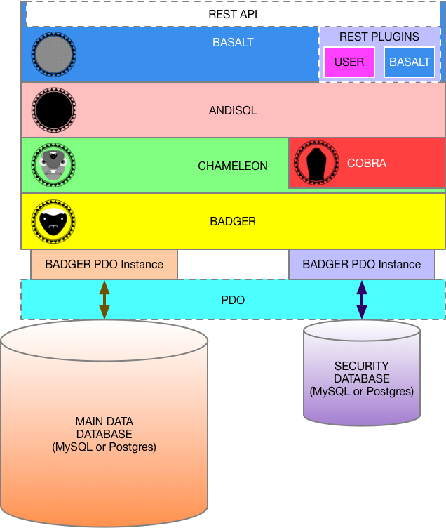

\page BASALT BASALT

BASALT
======

Part of the BAOBAB Server, which is part of the Rift Valley Platform
--------------------------------------------------------------------

INTRODUCTION
============
BASALT is the [REST API](https://restfulapi.net) and extension framework of the Rift Valley Platform.

Think of it as "part one" of the [CONTROLLER](https://www.tutorialspoint.com/mvc_framework/mvc_framework_controllers.htm) layer of the [MVC Pattern](https://en.wikipedia.org/wiki/Model–view–controller). "Part two" will be provided by the client SDKs.

\ref ANDISOL is the "public face" of the [MODEL](https://www.tutorialspoint.com/mvc_framework/mvc_framework_models.htm) layer.

EXTENSIONS
==========
BASALT allows the creation of ["REST Plugins."](a00176.html) These are fairly simple PHP executables that are placed in known directories.

BASALT matches these to the plugin parameters in the [REST](https://restfulapi.net) URIs, and routes [REST](https://restfulapi.net) HTTP calls to the designated plugins, returning the result of the plugin processing.

[REST](https://restfulapi.net) Plugins are simple subclasses of the `A_CO_Basalt_Plugin` class, and are used in a very basic stateless fashion; inheriting utility functions from the abstract base class.

BASALT [REST](https://restfulapi.net) Plugins only have two public abstract methods, and one protected method:

- `A_CO_Basalt_Plugin::plugin_name`

    This is an extremely basic method that simply returns the name of the plugin for use by the main BASALT system.
    
- `A_CO_Basalt_Plugin::process_command`

    This is the method that actually processes the [REST](https://restfulapi.net) command. The (possibly logged-in) \ref ANDISOL object is passed in, along with the HTTP method, response type, and any further commands and/or query parameters.
    
    The method will respond with a string to be returned, reflecting the result of the requested command.
    
- `A_CO_Basalt_Plugin::_get_xsd`

    This is a very simple method that simply returns the POSIX path to the [XSD](https://www.w3.org/XML/Schema) file fragment for this plugin. This schema must be comprehensive for ALL possible XML responses from the plugin.
    
BASALT will include a few "built in" plugins, but the implementor of the server can write and install more plugins, giving a very powerful facility for managing [REST](https://restfulapi.net) interactions.

REST API
========
BASALT expresses a pseudo-[REST](https://restfulapi.net) API access to the Rift Valley BAOBAB server. It is not a "true" REST API, in that the PUT and POST methods are handled differently than "true" REST.

The server can be configured to require that all [REST](https://restfulapi.net) access be done as [TLS (SSL/HTTPS)](https://en.wikipedia.org/wiki/Transport_Layer_Security), and uses a "server secret/API Key" method of authentication.

REST METHODS
------------
BASALT's [REST](https://restfulapi.net) API implements the following [methods](http://www.restapitutorial.com/lessons/httpmethods.html):

- [`GET`](https://www.w3.org/Protocols/rfc2616/rfc2616-sec9.html#sec9.3)

    This is the classic "show me the money" method. It can be easily expressed in a standard browser URI. Use this to fetch resources (like doing searches). You do not have to be authenticated to use this method.
    
- [`POST`](https://www.w3.org/Protocols/rfc2616/rfc2616-sec9.html#sec9.5)

    This is used to create new resources. You must have an authenticated login to use this.
    
- [`PUT`](https://www.w3.org/Protocols/rfc2616/rfc2616-sec9.html#sec9.6)

    This is used to update/modify resources. It can be used where only the changed portion of a resource is provided. You must have an authenticated login to use this.
    
- [`DELETE`](https://www.w3.org/Protocols/rfc2616/rfc2616-sec9.html#sec9.7)

    This deletes a resource. You must have an authenticated login to use this.

RESPONSE TYPES
--------------
BASALT's [REST](https://restfulapi.net) API can return data in the following formats:

- [`json`](https://json.org)

    This is the most common "lightweight" protocol used for access. It is well-supported by most libraries and [ECMAScript](https://en.wikipedia.org/wiki/ECMAScript) implementations, such as [JavaScript](https://www.w3.org/standards/webdesign/script), and other programming languages.
    
- [`xml`](https://www.w3.org/XML/)

    This is a strictly-defined protocol that is common for a lot of semantic implementations. XML output exactly correlates to JSON. Additionally, all XML output must validate to a published schema.
    
- [`xsd`](https://www.w3.org/XML/Schema)

    This is the validation schema for the XML output. Each plugin must publish a schema to validate its XML against.
    
- Simple String

    This is only returned by the login operation. The API key is returned as a simple UTF-8 string.
    
AUTHENTICATION
--------------
In order to log into the BAOBAB server, you must call it once with a basic username/password combination, in a simple GET call. The server can be configured to require that this always be [TLS (SSL/HTTPS)](https://en.wikipedia.org/wiki/Transport_Layer_Security).

Once you have successfully logged in, the server will respond with a simple text resonse, containing a timed API key. You will then place this API key in BOTH the user and password fields of the [HTTP authorization header](https://www.w3.org/Protocols/rfc2616/rfc2616-sec14.html#sec14.8) of subsequent calls.

Example in [a PHP cURL](http://php.net/manual/en/function.curl-setopt.php) implementation (where "$api_key" contains the string returned from the login call):

    curl_setopt($curl, CURLOPT_USERPWD, "$api_key:$api_key");

The API key is timed with a fixed clock. The time is determined by the server, but the default is 1 hour (60 minutes) for standard logins, and 10 minutes for the "God" login (the superuser). The clock is not reset during use, so it is an absolute time limit. Once you log in, the clock starts ticking, whether or not you access the server afterwards.

REST API URI STRUCTURE
----------------------
When you call the [REST](https://restfulapi.net) API, you will do so in the standard fashion, where you define the method ([HTTP 1.1 header](https://www.w3.org/Protocols/rfc2616/rfc2616-sec9.html)), and specify the resource in a URI, which can include query data.
    
**Initial Login Call:**

    {GET} http[s]://{SERVER URL}/login?login_id={LOGIN ID STRING}&password={PASSWORD STRING}

The {SERVER URL} is the URL path that specifies the BAOBAB server [REST](https://restfulapi.net) entrypoint (like `"example.com/rest_api/baobab/entrypoint.php"`).

In this instance, you directly call the [REST](https://restfulapi.net) entrypoint, specifying only `"login"` (which also means that you can't create a plugin named "login").
The query parameters are:

The query parameters are:

- `login_id`

    This is the user's login ID (a simple string)
    
- `password`

    This is the cleartext password for that login.
    
This is only called once, and cannot be combined with any other commands. The only operation permitted is a simple login.

The response will be a simple string. This will be a 64-character random token that should be applied in the username AND password sections of the [HTTP authorization header](https://www.w3.org/Protocols/rfc2616/rfc2616-sec14.html#sec14.8) header of subsequent calls.
    
**Logout Call:**

    {GET} http[s]://{SERVER URL}/logout

This is a call that should be made while a valid API key has been assigned to a user. It should be made with the user's valid API key in the [HTTP authorization header](https://www.w3.org/Protocols/rfc2616/rfc2616-sec14.html#sec14.8), and will terminate the API key, requiring subsequent calls by the same user to perform another login. 

**Standard REST Calls:**

    {GET | POST | PUT | DELETE} http[s]://{SERVER URL}/{RESPONSE TYPE}/{PLUGIN}/[{COMMAND[S]}][?][{QUERY PARAMETER NAME}[={QUERY PARAMETER VALUE}]]

- `{RESPONSE TYPE}`

    This is `"xml"`, `"json"` or `"xsd"`. If it is `"xsd"`, then commands and query parameters will be ignored. The response will be an [XML Schema](https://www.w3.org/XML/Schema) document.
    
- `{PLUGIN}`

    This is the all-lowercase name of the BASALT Extension plugin.
    There is a BASALT "virtual plugin" called `"baseline"`. This will return a list of available plugins, if called directly. (Example: `http[s]://{SERVER URL}/{RESPONSE TYPE}/baseline/`)
    
- `{COMMAND[S]}`

    This represents a single command (or a series of commads, which are expressed as `"command1/command2/command3/"` etc.) for the plugin. These follow the `/{PLUGIN}/` URI component.
    
If you will be providing query parameters to the [REST](https://restfulapi.net) call, then these are attached after the question mark.
`{RESPONSE TYPE}` and `{PLUGIN}` are required. The other elements are optional, and plugin-dependent. Each plugin will define its own [REST](https://restfulapi.net) query structure that is parsed after the `{PLUGIN}`.

LOGGING
-------
There is facility for logging. You can define a log handler function in the configuration, which will be called upon successful instantiation of an \ref ANDISOL instance. This is not meant to replace the standard HTTP logs from the server, but is focused on the BAOBAB server, and will report the current logged-in user.

Logging is not enabled by default. It should be noted that it is possible that logging can have legal, technical and resource limitation issues. You should make sure that there are no issues with logging before enabling it.

SUBPROJECTS
===========
\ref ANDISOL is the "public face" of the lowest levels of the Rift Valley Platform. It encapsulates the model (database or server connections), and provides an object-based, functional model to the implementation layers.

\ref COBRA is the security administration toolbox for the Rift Valley Platform. It is only available to logged-in users that are "manager" users; capable of editing other users.

\ref CHAMELEON is the "First Layer Abstraction" from the data storage and retrieval. It implements a few higher-level capabilities, such as collections, users and places.

\ref BADGER is the "First Layer Connection" to the data storage subsystem. It uses [PHP PDO](http://php.net/manual/en/book.pdo.php) to abstract from the databases, and provide SQL-injection protection through the use of [PHP PDO Prepared Statements](http://php.net/manual/en/pdo.prepared-statements.php).

LICENSE
=======

© Copyright 2018, [Little Green Viper Software Development LLC](https://littlegreenviper.com).
This code is ENTIRELY proprietary and not to be reused, unless under specific, written license from [Little Green Viper Software Development LLC](https://littlegreenviper.com).
