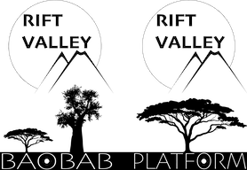

\page things-plugin THINGS STANDARD REST PLUGIN

BASALT THINGS REST PLUGIN
=========================

Part of the BASALT Extension Layer, Which is Part of the BAOBAB Server, which is part of the Rift Valley Platform
-----------------------------------------------------------------------------------------------------------------

INTRODUCTION
============

The Things Plugin is a \ref BASALT [REST](https://restfulapi.net) Plugin; part of the "standard" set.

You use this plugin to access general data items in the BAOBAB server.

LICENSE
=======

© Copyright 2018, [Little Green Viper Software Development LLC](https://littlegreenviper.com).
This code is ENTIRELY proprietary and not to be reused, unless under specific, written license from [Little Green Viper Software Development LLC](https://littlegreenviper.com).
